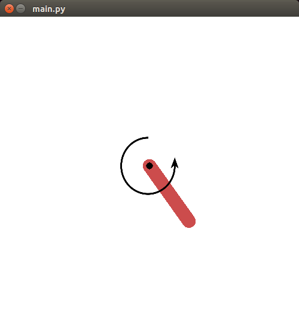
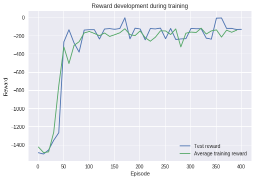

# Reinforcement Learning with (Deep) Q Networks in Continuous Action Spaces

This is a demo of some techniques presented in the 2016 paper [**Continuous control with deep reinforcement learning**](https://arxiv.org/abs/1509.02971) by *Lillicrap et al*.

This demo uses a low-dimensional RL problem from the OpenAI gym and demonstrates the following ideas from the setup in the paper:

- Deterministic policy gradients are used to update the actor network,
- Exploration and training are separated by using a *replay buffer*,
- Target networks are updated slowly.

(Still missing: batch normalization.
It appears that at least `tflearn` contains an implementation, but I'm using vanilla TensorFlow to learn, so I may have to look into implementing this myself.)

## Setup

This demo uses the `Pendulum-v0` environment.
It is a minimal problem with a continuous (one-dimensional) action space, representing the magnitude and direction of a torque applied to the pendulum.

(Theoretically, the demo should work with a different low-dimensional environment.
I will probably try it out once I've got the first version working reliably.
For something pixel-based, one would probably want to add convolutional layers that aren't used here.)

## Results

Pendulum environment; default settings.
Testing reward against average training reward over ten training episodes.
Note that during training we are not performing at our "current known best" because of the noise.

## Future work

- Add *batch normalization*
- *Prioritized experience replay*. Especially with big buffer sizes, it appears like we're learning slower as we're training on all sorts of stupid moves the initial network was performing. :)
- Try a different environment (probably another OpenAI gym type thing)
- If feeling adventurous, try a low-dimensional pixel environment

## Links

- [**Continuous control with deep reinforcement learning. *Lillicrap et al, 2016.***](https://arxiv.org/abs/1509.02971)
- [`tflearn` **writeup and code demo of the same techniques, by *Patrick Emami***](http://pemami4911.github.io/blog/2016/08/21/ddpg-rl.html)